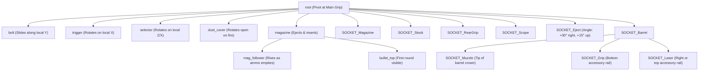
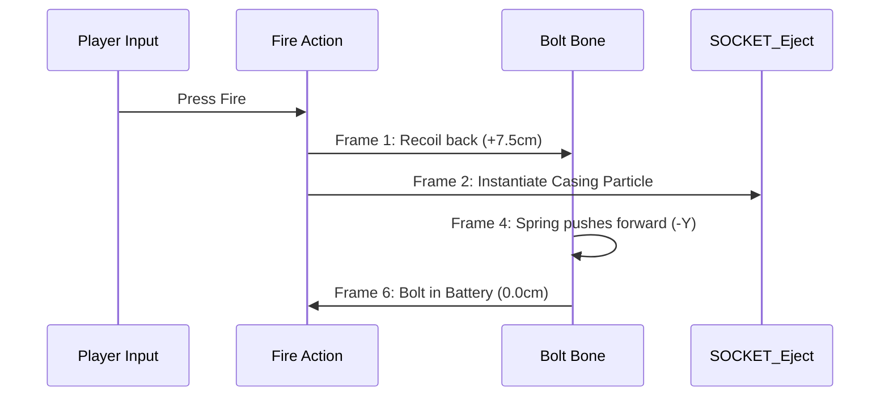

# Call of Duty Style Modular Weapon Architecture Guide (Gunsmith Standard)

A production-ready technical reference for 3D artists, technical animators, and game developers creating modular, customizable firearm systems for modern first-person shooters (similar to _Call of Duty: Modern Warfare Gunsmith_ and _Infima Games Low Poly Shooter Pack_).

---

## 1. Modular Breakdown (The Gunsmith Architecture)

In a Call of Duty-style weapon customization system, a firearm is never a single mesh. It is a **Core Receiver Platform** with interchangeable sub-assemblies connected via standardized mounting interfaces.

```
                         [ OPTIC ]
                             │
[ MUZZLE ] ── [ BARREL ] ── [ RECEIVER / CORE ] ── [ STOCK ]
                  │                 │                  │
            [ UNDERBARREL ]   [ MAGAZINE ]        [ REAR GRIP ]
```

### 1.1 The 9 Primary Weapon Slots

| Slot                | Component Description                                                                                      | Parent Link                  | Typical Swappable Variations                                  |
| :------------------ | :--------------------------------------------------------------------------------------------------------- | :--------------------------- | :------------------------------------------------------------ |
| **Receiver (Core)** | The serial-numbered firearm body containing trigger group, internal fire control, and upper/lower housing. | `root` bone                  | Caliber conversions, material variants, receiver body kits    |
| **Barrel**          | Barrel assembly including gas block, handguard/shroud, and rifled tube.                                    | Receiver (`SOCKET_Barrel`)   | Short/CQC, Standard, Heavy/Marksman, Integrally Suppressed    |
| **Muzzle Device**   | Screws or clamps onto the barrel crown.                                                                    | Barrel (`SOCKET_Muzzle`)     | Flash Hider, Muzzle Brake, Compensator, Tactical Suppressor   |
| **Optic / Sight**   | Mounts to receiver or handguard top rail.                                                                  | Receiver (`SOCKET_Scope`)    | Iron Sights, Reflex/Red Dot, Holographic, ACOG, Sniper Scope  |
| **Stock**           | Mounts to the buffer tube or rear receiver trunnion.                                                       | Receiver (`SOCKET_Stock`)    | Collapsible, Folding, Heavy Precision, Wire Stock, No Stock   |
| **Magazine**        | Detachable ammunition feed device.                                                                         | Receiver (`SOCKET_Magazine`) | 20-round short, 30-round standard, 50-round drum, Magpul PMAG |
| **Underbarrel**     | Mounts to the bottom handguard rail or M-LOK slots.                                                        | Barrel (`SOCKET_Grip`)       | Vertical Foregrip, Angled Foregrip, Handstop, Bipod           |
| **Laser / Light**   | Mounts to the top or side handguard rails.                                                                 | Barrel (`SOCKET_Laser`)      | Tactical Flashlight, 5mW Green Laser, IR PEQ-15 Box           |
| **Rear Grip**       | Pistol grip attached beneath the receiver.                                                                 | Receiver (`SOCKET_RearGrip`) | Rubberized, Ergonomic Stippled, Skeletonized lightweight      |

---

## 2. 3D Modeling & Topology Standards

### 2.1 Modeling Interior Cavities

When building weapons that animate (bolt recoil, reload drops, chamber checks):

1. **Ejection Port Cavity**:
   - Never leave the ejection port flat or closed.
   - Model the recessed chamber, feed ramp, and bolt carrier travel channel.
   - Ensure geometry has inward-facing faces with proper UV unwrapping so empty space doesn't show backface-culling transparency.
2. **Magwell Interior**:
   - Model the magazine well hollow with at least 3–4 cm of upward depth.
   - Add the magazine release catch geometry inside the well.
3. **Movable Internal Components (Separate Mesh Islands)**:
   - **Bolt Carrier Group (BCG)**: Fully modeled bolt face with extractor claw and firing pin indentation.
   - **Charging Handle**: Separated if the gun uses a non-reciprocating handle (e.g., AR-15, MP5, G36) or attached if reciprocating (e.g., AK-47, SCAR).
   - **Trigger**: Independent mesh pivotable around its retaining pin.
   - **Fire Selector Switch**: Modeled with Safe / Semi / Auto detent notches.
   - **Dust Cover / Ejection Cover**: Modeled on a hinge pin with spring detail.

### 2.2 Standard Rail Dimensions (MIL-STD-1913 Picatinny)

To make attachments universal across multiple weapons, model all accessory rails to real-world or uniform stylized scale:

- **Rail Width**: `21.2 mm`
- **Groove Slot Width**: `5.23 mm`
- **Slot Depth**: `3.0 mm`
- **Slot Center-to-Center Spacing**: `10.0 mm`
- **Side Flange Angle**: `45°` chamfer

---

## 3. Armature Hierarchy (The Unified Weapon Rig)

All attachments and moving parts share a single coordinated skeleton convention.



### 3.1 Standard Bone Coordinates & Axes

| Bone Name        | Purpose                                      | Motion Type            | Local Axis Convention                                       |
| :--------------- | :------------------------------------------- | :--------------------- | :---------------------------------------------------------- |
| **`root`**       | Weapon origin and parent of all fixed parts. | None                   | Positioned at center of trigger guard or primary hand grip. |
| **`bolt`**       | Recoil carrier & charging assembly.          | Translation            | **+Y = Rearward (Recoil)**, **-Y = Forward (Battery)**      |
| **`magazine`**   | Detachable magazine during reload.           | Translation & Rotation | Moves downward (-Z) during reload drops.                    |
| **`trigger`**    | Trigger pull response.                       | Rotation               | Rotates **+X** (pull) / **-X** (reset).                     |
| **`selector`**   | Fire mode selector (Safe/Semi/Auto).         | Rotation               | Rotates around pin axis to switch fire positions.           |
| **`dust_cover`** | Ejection port spring-loaded flap.            | Rotation               | Flips downward 90° upon first bolt cycle.                   |

---

## 4. Socket System Specifications

Sockets are leaf bones (or empty null transforms) used by game engines (Unity / Unreal Engine) to attach accessories, spawn VFX, and align hands.

```
[SOCKET_Muzzle] ────── Tip of barrel (Muzzle flash, tracer raycast, suppressor attach)
[SOCKET_Laser] ─────── Handguard side/top rail (Laser beam origin, flashlight cone)
[SOCKET_Grip] ──────── Bottom handguard rail (Vertical/angled grip attach, left-hand IK)
[SOCKET_Scope] ─────── Top receiver rail (Optic model attachment, ADS camera target)
[SOCKET_Eject] ─────── Ejection port (Shell casing physics spawn, ejection velocity vector)
[SOCKET_Magazine] ──── Magwell opening (Magazine snap target, left-hand reload IK)
[SOCKET_Stock] ─────── Rear receiver trunnion (Stock attachment point)
```

> [!IMPORTANT]
> **Socket Transform Rule**: Every socket must have its **Forward vector (Local +Z or +Y depending on engine)** pointing directly down the attachment orientation. For `SOCKET_Eject`, angle the local transform **30° outward and 15° upward** so the physics particle system can directly use the socket's forward vector as the ejection velocity impulse.

---

## 5. Rigid Vertex Weighting (Skinning Rules)

Unlike organic characters where vertices blend weights across multiple bones (e.g. 0.6 elbow, 0.4 forearm), **weapons require 100% rigid weighting**.

### 5.1 Vertex Group Assignment Matrix

| Vertex Group   | Geometry Included                                                         | Weight Value | Forbidden Weights                        |
| :------------- | :------------------------------------------------------------------------ | :----------- | :--------------------------------------- |
| **`root`**     | Receiver upper/lower, buffer tube, barrel nut, sights base, trigger guard | `1.0`        | Never assign bolt or trigger geometry    |
| **`bolt`**     | Bolt carrier, bolt face, charging handle (if reciprocating)               | `1.0`        | Never assign receiver or barrel vertices |
| **`magazine`** | Magazine casing, baseplate, feed lips (if bundled with base mesh)         | `1.0`        | Must not influence magwell               |
| **`trigger`**  | Trigger shoe and pivot sear                                               | `1.0`        | Must not influence trigger guard         |
| **`selector`** | Selector switch lever                                                     | `1.0`        | Must not influence receiver wall         |

---

## 6. Mechanical Animation & Timing Cycles

FPS gun animations must feel punchy, weighty, and responsive. Firing cycles are measured in milliseconds and keyframe frames (assuming 60 FPS standard).

### 6.1 Firing Cycle Timing (Automatic Rifle, 750 RPM)

```
Frame 0:   Hammer drops / Muzzle flash fires (Bolt at rest: Y = 0.0)
Frame 1-2: Violent recoil kick (Bolt slams rearward: Y = +7.5 cm)
Frame 2:   Shell casing spawns from SOCKET_Eject with rotational impulse
Frame 3-5: Recoil spring return (Bolt slides forward: Y = 0.0)
Frame 6:   Bolt locks into battery / Next round chambered
```



### 6.2 Reload States

- **Tactical Reload (Ammo > 0)**:
  1. Left hand pulls magazine out (`magazine` bone translates down).
  2. Fresh magazine inserted (`magazine` bone snaps into `SOCKET_Magazine`).
  3. Bolt does **not** move (already chambered).
- **Empty Reload (Ammo = 0)**:
  1. Bolt is already locked in rearward position (`bolt` at `Y = +7.5 cm`).
  2. Old magazine dropped.
  3. Fresh magazine inserted.
  4. Charging handle pulled or bolt catch released $\rightarrow$ bolt slams forward into battery (`Y = 0.0`).

---

## 7. Automated Blender Rigging Script

You can copy and run this Python script directly in Blender's Scripting workspace (or trigger it via Blender MCP) to automatically build this complete rig on any weapon model.

```python
import bpy
import mathutils

def create_modular_weapon_rig(weapon_mesh_name="WeaponMesh"):
    # Ensure object mode
    if bpy.context.object and bpy.context.object.mode != 'OBJECT':
        bpy.ops.object.mode_set(mode='OBJECT')

    mesh = bpy.data.objects.get(weapon_mesh_name)
    if not mesh:
        print(f"Error: Mesh '{weapon_mesh_name}' not found.")
        return

    # Create Armature
    arm_data = bpy.data.armatures.new("Armature_ModularWeapon")
    arm_obj = bpy.data.objects.new("SKEL_ModularWeapon", arm_data)
    bpy.context.collection.objects.link(arm_obj)

    bpy.context.view_layer.objects.active = arm_obj
    bpy.ops.object.mode_set(mode='EDIT')

    edit_bones = arm_data.edit_bones

    # 1. Root Bone (At grip/origin)
    root = edit_bones.new('root')
    root.head = (0, 0, 0)
    root.tail = (0, 0.1, 0)

    # 2. Bolt Bone (Chamber slider)
    bolt = edit_bones.new('bolt')
    bolt.head = (0, -0.10, 0.08)
    bolt.tail = (0, -0.02, 0.08)
    bolt.parent = root

    # 3. Trigger Bone
    trigger = edit_bones.new('trigger')
    trigger.head = (0, -0.04, 0.02)
    trigger.tail = (0, -0.05, -0.02)
    trigger.parent = root

    # 4. Sockets
    sockets = {
        'SOCKET_Muzzle': (0, -0.75, 0.06),
        'SOCKET_Eject': (0.02, -0.12, 0.08),
        'SOCKET_Scope': (0, -0.15, 0.12),
        'SOCKET_Magazine': (0, -0.18, -0.05),
        'SOCKET_Stock': (0, 0.25, 0.05),
        'SOCKET_Grip': (0, -0.45, 0.01),
        'SOCKET_Laser': (0.03, -0.55, 0.06)
    }

    for sock_name, pos in sockets.items():
        sock_bone = edit_bones.new(sock_name)
        sock_bone.head = pos
        sock_bone.tail = (pos[0], pos[1] - 0.03, pos[2])
        sock_bone.parent = root

    bpy.ops.object.mode_set(mode='OBJECT')

    # Parent Mesh to Armature
    mesh.select_set(True)
    arm_obj.select_set(True)
    bpy.context.view_layer.objects.active = arm_obj
    bpy.ops.object.parent_set(type='ARMATURE_NAME')

    # Add Limit Location Constraint to Bolt in Pose Mode
    bpy.ops.object.mode_set(mode='POSE')
    p_bolt = arm_obj.pose.bones.get('bolt')
    con = p_bolt.constraints.new(type='LIMIT_LOCATION')
    con.owner_space = 'LOCAL'
    con.use_min_x = con.use_max_x = True
    con.use_min_z = con.use_max_z = True
    con.min_x = con.max_x = con.min_z = con.max_z = 0.0
    con.use_min_y = True
    con.min_y = 0.0
    con.use_max_y = True
    con.max_y = 0.08  # 8 cm max recoil travel

    bpy.ops.object.mode_set(mode='OBJECT')
    print("Modular weapon rig created successfully!")

# To run:
# create_modular_weapon_rig("Your_Gun_Mesh_Name")
```

---

## 8. Unity Game Engine Integration

### 8.1 Attachment ScriptableObject Data Structure

In Unity, attachments are defined as ScriptableObjects that reference prefab models and modify weapon stats:

```csharp
using UnityEngine;

[CreateAssetMenu(fileName = "NewAttachment", menuName = "Gunsmith/Attachment")]
public class WeaponAttachmentSO : ScriptableObject
{
    public enum AttachmentType { Muzzle, Barrel, Optic, Stock, Underbarrel, Magazine, Laser }

    public string attachmentName;
    public AttachmentType slotType;
    public GameObject attachmentPrefab;

    [Header("Weapon Stat Modifiers")]
    public float recoilModifier = 1.0f;       // 0.85 = -15% recoil
    public float adsSpeedModifier = 1.0f;     // 1.10 = 10% slower aim
    public float bulletVelocityModifier = 1.0f;
}
```

### 8.2 Runtime Socket Mounting Script

This script finds the appropriate socket bone on the weapon armature and instantiates the chosen attachment:

```csharp
using UnityEngine;

public class WeaponModularAssembly : MonoBehaviour
{
    [Header("Sockets")]
    public Transform socketMuzzle;
    public Transform socketOptic;
    public Transform socketMagazine;
    public Transform socketStock;
    public Transform socketUnderbarrel;

    public void MountAttachment(WeaponAttachmentSO attachment)
    {
        Transform targetSocket = attachment.slotType switch
        {
            WeaponAttachmentSO.AttachmentType.Muzzle => socketMuzzle,
            WeaponAttachmentSO.AttachmentType.Optic => socketOptic,
            WeaponAttachmentSO.AttachmentType.Magazine => socketMagazine,
            WeaponAttachmentSO.AttachmentType.Stock => socketStock,
            WeaponAttachmentSO.AttachmentType.Underbarrel => socketUnderbarrel,
            _ => null
        };

        if (targetSocket == null) return;

        // Clear existing attachment in this slot
        foreach (Transform child in targetSocket)
        {
            Destroy(child.gameObject);
        }

        // Spawn new attachment
        if (attachment.attachmentPrefab != null)
        {
            GameObject newObj = Instantiate(attachment.attachmentPrefab, targetSocket);
            newObj.transform.localPosition = Vector3.zero;
            newObj.transform.localRotation = Quaternion.identity;
        }
    }
}
```

---

## 9. Checklists Before Final FBX Export

1. [ ] **Apply All Transforms**: In Blender Object Mode, select all parts $\rightarrow$ <kbd>Ctrl</kbd> + <kbd>A</kbd> $\rightarrow$ **All Transforms** (Scale `(1, 1, 1)`, Rotation `(0, 0, 0)`).
2. [ ] **Unit Scale**: Confirm Scene Properties $\rightarrow$ Unit System: **Metric**, Unit Scale: `1.000000`.
3. [ ] **Check Weight Integrity**: Verify that `bolt` vertices have weight `0.0` on `root`, and receiver vertices have weight `0.0` on `bolt`.
4. [ ] **Export Settings (FBX)**:
   - **Include**: Selected Objects (Armature + Meshes).
   - **Transform**: Apply Scalings: `FBX All`, Forward: `-Z Forward`, Up: `Y Up`.
   - **Armature**: **Uncheck** _Add Leaf Bones_.
   - **Bake Animation**: Checked if actions exist.


---

## 10. Standardized Naming Scheme (Call of Duty / Infima Standard)

To maintain a scalable Gunsmith system across dozens of weapons and hundreds of attachments, use strict tokenized naming conventions.

### 10.1 Asset File Prefixes (AAA Industry Standard)

| Prefix | Asset Type | Example |
| :--- | :--- | :--- |
| **SK_** | **Skeletal Mesh** (Any mesh bound to an armature, e.g. base receiver) | SK_AR_01.fbx, SK_SMG_Vector.fbx |
| **SM_** | **Static Mesh** (Modular attachment models without bones) | SM_AR_01_Scope_Holo.fbx, SM_AR_01_Mag_Drum.fbx |
| **SKEL_**| **Armature / Skeleton** | SKEL_AR_01, SKEL_Pistol_02 |
| **A_**   | **Animation Clip** | A_FP_AR_01_Fire.fbx, A_FP_AR_01_Reload.fbx |
| **M_**   | **Material** | M_Weapon_AR_01_Body, M_Attachment_Optic |
| **T_**   | **Texture Map** | T_AR_01_BaseColor, T_AR_01_Normal |
| **PF_**  | **Prefab** (Unity) or **BP_** Blueprint (Unreal) | PF_Weapon_AR_01, PF_Attach_Muzzle_Suppressor |

### 10.2 Token Structure for Modular Components

Structure file and object names using this formula:
[Prefix]_[Category]_[WeaponID]_[Component]_[Variant]

Examples:
* SM_AR_01_Barrel_Short
* SM_AR_01_Barrel_Suppressed
* SM_AR_01_Muzzle_Compensator
* SM_AR_01_Muzzle_Suppressor_Tactical
* SM_AR_01_Magazine_Standard30
* SM_AR_01_Magazine_Drum50
* SM_AR_01_Optic_RedDot
* SM_AR_01_Optic_Sniper8x
* SM_AR_01_Stock_Collapsible
* SM_AR_01_Underbarrel_VerticalGrip

### 10.3 Rig Bones & Sockets Naming Rules

* **Mechanical Bones**: Lowercase snake_case (matches vertex groups 1:1)
  * 
oot
  * olt
  * charging_handle
  * magazine
  * 	rigger
  * selector
  * dust_cover
* **Attachment & VFX Sockets**: All uppercase with SOCKET_ prefix
  * SOCKET_Muzzle (Spawns muzzle flash VFX, bullet tracer origin, muzzle brake attach)
  * SOCKET_Eject (Spawns brass shell casing particles)
  * SOCKET_Scope (Attaches optics / sights)
  * SOCKET_Magazine (Attaches magazine prefabs, left-hand reload IK anchor)
  * SOCKET_Grip (Attaches underbarrel foregrips, left-hand idle IK anchor)
  * SOCKET_Laser (Attaches tactical lasers/flashlights)
  * SOCKET_Stock (Attaches buffer tube / stocks)
  * SOCKET_Barrel (Attaches modular barrel assemblies)
  * SOCKET_RearGrip (Attaches pistol grips)

### 10.4 Animation Naming Formula

A_[View]_[Category]_[WeaponID]_[Action]_[Modifier]

* **View**: FP (First Person) or TP (Third Person)
* **Examples**:
  * A_FP_AR_01_Idle
  * A_FP_AR_01_Fire
  * A_FP_AR_01_Fire_LastRound
  * A_FP_AR_01_Reload_Tactical
  * A_FP_AR_01_Reload_Empty
  * A_FP_AR_01_Aim_In
  * A_FP_AR_01_Aim_Out
  * A_FP_AR_01_Inspect
