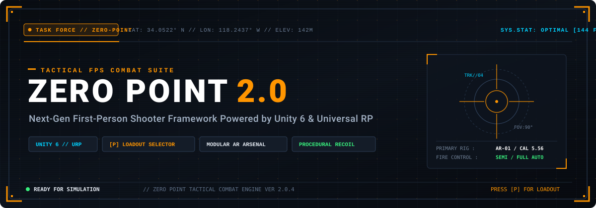
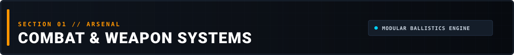
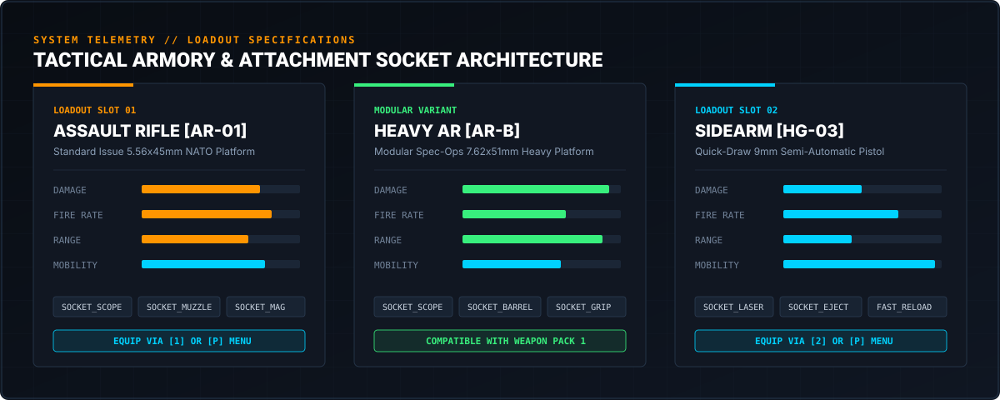
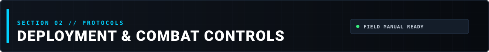
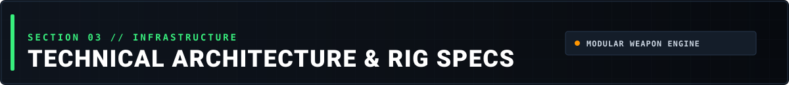

<p align="center">
  
</p>

<p align="center">
  <a href="https://unity.com/"></a>
  <a href="#combat-controls"></a>
  <a href="#weapons-arsenal"></a>
  <a href="https://github.com/GopikChenth/ZeroPoint"></a>
</p>

---

## 📋 Mission Dossier // Executive Overview

> **PROJECT DESIGNATION:** `OPERATION ZERO-POINT 2.0`  
> **OPERATIONAL THEATER:** First-Person Tactical Shooter Framework  
> **RENDER PIPELINE:** Universal Render Pipeline (URP 17.0+)  
> **CORE ARCHITECTURE:** Dynamic Weapon Sockets, Rigged First-Person Animation System, Procedural ADS & Recoil Mechanics.

**Zero Point 2.0** is a modern tactical first-person shooter framework engineered for high-responsiveness and modularity in Unity 6. Featuring an in-game **Tactical Weapon Selection System ([P] Key)**, modular firearm bone sockets, procedural recoil physics, and modernized URP visual effects (muzzle flashes, smoke discharge, bullet casing ejection).

---

<p align="center">
  
</p>

### 🎯 Primary Ballistics & Loadout

<p align="center">
  
</p>

| Weapon Class | Model / Caliber | Rate of Fire | Magazine Capacity | Recoil Control | Sockets & Attachments |
| :--- | :--- | :--- | :--- | :--- | :--- |
| **Assault Rifle** | `AR-01` // 5.56x45mm | 750 RPM | 30 Rounds | High stability, linear climb | Iron Sights, Red Dot, Compensator, Extended Mag |
| **Heavy AR (Variant)** | `AR-B` // 7.62x51mm | 620 RPM | 25 Rounds | Heavy vertical kick, punchy | Tactical Rail, Suppressor, Foregrip, Heavy Mag |
| **Tactical Sidearm** | `HG-03` // 9x19mm Parabellum | Semi-Auto | 15 Rounds | Rapid reset, minimal sway | Flashlight, Laser Sight, Threaded Barrel |

#### Key Combat Mechanics:
- **Procedural Aim Down Sights (ADS):** Seamless sub-millisecond camera & weapon transition to optic alignment.
- **Physical Bone Reloads:** Detachable animated magazines that cycle through the character's first-person hand rig during tactical or empty reload animations.
- **Dynamic Ballistics & Projectiles:** Modular bullet physics supporting trajectory drop, penetration, and surface decal generation.
- **Modernized URP VFX:** Upgraded particle systems for realistic muzzle flash burst, barrel heat distortion, shockwaves, and smoke lingering.

---

<p align="center">
  
</p>

### 🎮 Operator Field Manual // Keybindings

| Input Key | Tactical Action | Operational Details |
| :---: | :--- | :--- |
| **`W` `A` `S` `D`** | Tactical Movement | Standard omnidirectional traversal with grounded physics |
| **`Left Shift`** | Tactical Sprint | Weapon dips into ready carry position for maximum sprint speed |
| **`Left Ctrl`** | Slide & Crouch | Dynamic knee slide transition into low-profile stance |
| **`Mouse 1`** | Primary Fire | Semi or full-automatic kinetic ballistic discharge |
| **`Mouse 2`** | Aim Down Sights (ADS) | Elevates weapon to target eye-line; tightens shot dispersion |
| **`R`** | Tactical Reload | Ejects spent magazine and cycles chamber |
| **`P`** | **Tactical Loadout Menu** | **Opens in-game loadout interface to swap weapons on the fly** |
| **`1` / `2`** | Quick Weapon Switch | Hotkey access to Primary Rifle (`1`) or Secondary Sidearm (`2`) |
| **`Scroll Wheel`** | Cycle Arsenal | Wraps seamlessly between all weapons in inventory |

---

<p align="center">
  
</p>

### 🛠️ Rig & Weapon Socket Architecture

All weapons in **Zero Point** operate under an interconnected bone socket hierarchy, ensuring complete compatibility with first-person animated arms:

```text
P_LPSP_FP_CH (Player Controller)
├── P_LPSP_Inventory (Inventory Manager)
│   ├── P_LPSP_WEP_AR_01 (Equipped Weapon Script)
│   │   ├── SKEL_AR_01 (Armature)
│   │   │   └── root
│   │   │       ├── bolt              <- Driven by AC_LPSP_WEP Animator
│   │   │       ├── magazine          <- Synchronized with player reload hand
│   │   │       │   └── SOCKET_Magazine
│   │   │       ├── SOCKET_Muzzle     <- Muzzle flash, tracer, and smoke spawns
│   │   │       ├── SOCKET_Default    <- Standard iron sight mount
│   │   │       ├── SOCKET_Scope      <- Aftermarket optical sight mount
│   │   │       └── SOCKET_Grip       <- Underbarrel stabilization socket
│   │   └── SM_AR_01 (Mesh)
│   └── P_LPSP_WEP_Handgun_03 (Secondary Sidearm)
└── Canvas_WeaponSelection (In-Game [P] Menu UI)
```

#### Swapping to Other AR Models:
The project includes modular models in `Assets/Low Poly AR Weapon Pack 1/Prefabs/Weapons/` (`AR_A_1`, `AR_B`, `AR_C`, `AR_D`, `AR_E`):
1. Duplicate `P_LPSP_WEP_AR_01` to create a variant prefab (e.g., `P_LPSP_WEP_AR_B`).
2. Parent the new mesh parts under `SKEL_AR_01 -> root` (and child magazine under `magazine`).
3. Add the new weapon under `P_LPSP_Inventory`. The **[P] Loadout Menu** will dynamically detect and render the new weapon card automatically!

---

### 🚀 Rapid Deployment // Installation

1. **Prerequisites:**
   - **Unity 6 (6000.x)** or Unity 2022.3+ LTS.
   - **Universal Render Pipeline (URP)** package installed.
   - **TextMeshPro** installed and imported.

2. **Clone the Repository:**
   ```bash
   git clone https://github.com/GopikChenth/ZeroPoint.git
   ```

3. **Launch the Demo Simulation:**
   - Open Unity Hub and add the cloned folder.
   - Navigate to `Project` → `Assets` → `Infima Games` → `Low Poly Shooter Pack - Free Sample` → `Scenes`.
   - Open **`S_Content_Overview.unity`**.
   - Press **Play** ▶️ and press **`P`** to access your tactical loadout!

---

<p align="center">
  <sub>ZERO POINT 2.0 // DEVELOPED FOR MODERN COMBAT SIMULATION // UNITY 6 LTS</sub>
</p>
